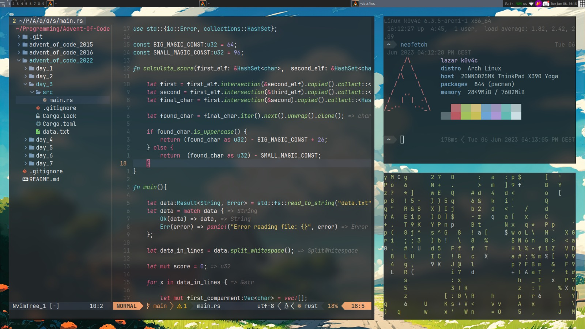

# dotfiles

## Collection of .config files included in my Linux setup

This repo is only for storing my custom config files.



## Installation

Git clone this repository in your .config folder, be sure that you backup yours first 

Assuming in home directory:

```bash
mkdir backup
cp -r .config/ backup/
```

```bash
git clone git@github.com:K0V4C/dotfiles.git
```

Or if you prefer https:

```bash
git clone https://github.com/K0V4C/dotfiles.git
```
This will only copy the file in home directory, it's on you to copy and paste what you want
in .config/ directory. I prefer it this way, it makes it less messy, at least for me.

## Credits

I will try to credit each document and cofig file to its author currently following are main inspirations:

chris@machine  
NvChad  
ThePrimeagen  

## Contributions

If you find some errors or optmizations I am glad to read them. Thanks in advance
